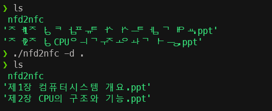

# NFD2NFC



Convert NFD(Normalization Form Canonical Decomposition) encoded Hangul to NFC(Normalization Form Canonical Composition) encoded Hangul.

```
nfd2nfc: A Dart implementation of Hangul NFD to NFC converter.

Usage:
-f, --file=<path>     Rename the file.
-d, --dir=<path>      Rename files under the directory.
-v, --[no-]verbose    Enable verbose mode.
-h, --help            Display this help information.
```
